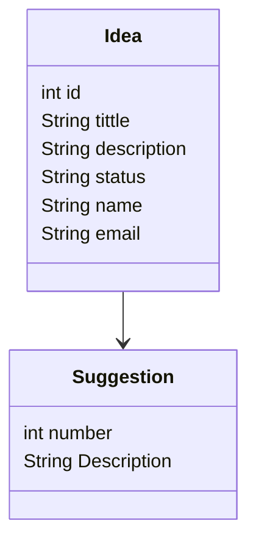

# Portfólio

## Portal de Ideias

### Autor

  - Daniela Marioti

### Professor

  - [Diogo Winck](https://github.com/dvwinck)

### Objetivo

O aplicativo tem como objetivo realizar o controle de envio de ideias enviadas pelo cliente, tornando possível além do envio de ideias, o controle da situação da mesma, tanto por parte do cliente quanto por parte da empresa prestadora de serviço. 

O aplicativo de envio de ideias apresenta duas interfaces:
    - Interface do cliente: Além de acessar a lista de ideias encaminhadas de acordo com seu *status*, podendo ser aprovada, reprovada ou pendente, a aplicação  apresenta o botão de envio de novas solicitações de melhoria, onde o mesmo deve informar o título da ideia, sua descrição e suas informações básicas de nome e e-mail.
    - Inteface do analista: Pelo lado do analista, após realizado o longin no aplicativo, o mesmo possui o controle de aprovação ou reprovação de novas ideias, além da visualização de todas as solicitações recebidas, bem como seu *status*. 
    
### Design do projeto - Figma

- [Portal de Ideias](https://www.figma.com/file/M5gOjNuWJQ7vaumCCdAofh/Portal-de-Ideias-Simples?node-id=0%3A1)

### Controle de tarefas - Trello

- [Portfolio](https://trello.com/invite/b/3NnNrPQF/ATTIbb606dbf4d3ee433adab7b41a092a29594FAF6D3/portfolio)

## Tecnologias utilizadas

### Dependências backend

  - [Node.js (versão 16)](https://nodejs.org/en/)
  - [Express](https://expressjs.com)
  - [SQlite](https://www.sqlite.org/index.html)
  - [Prisma js](https://www.prisma.io/docs/)
  - [ESlint](https://eslint.org/docs/)
  
##### Inicializando

  - API
    - `npm install`
    - Na raiz, criar pasta .env contendo a seguinte informação: DATABASE_URL="file:./dev.db"
    - `npm start`
    - `localhost:3000`
  - Eslint
    - `npx eslint --init`
    - `npm run lint`
    
## Diagramas

### Diagrama de estado

 ```mermaid
    stateDiagram-v2
      state interface <<choice>>
      [*] --> Portal
      Portal --> interface
      interface --> NovaIdeia: Cliente
      interface --> Entrar: Analista
      NovaIdeia --> Enviar
      NovaIdeia --> Cancelar
      Entrar --> Ideia
      Ideia --> Aprovar
      Ideia --> Reprovar    
  ```
 ### Diagrama de Classe
 
 ```mermaid
 classDiagram
    Home --|> NovaIdeia
    Home --|> Entrar
    Entrar --|> Inicio
    Inicio --|>  Analise
    Home : String ideia
    Home : int status
    NovaIdeia : int id
    NovaIdeia : String titulo
    NovaIdeia : String descricao
    NovaIdeia : String nome
    NovaIdeia : String email
    Entrar : String login
    Entrar : String senha
    Analise: int situacao

    class Entrar{
        + login()
    }

    class Home{
        +visualizarLista()
        +acessarIdeia()
        +nova()
        +aprovada()
        +reprovada()
    }

    class Inicio{
        -String NovaIdeia
        - int situacao
        +visualizarLista()
        +acessarIdeia()

    }

    class NovaIdeia{
        +acessarIdeia()
        +enviar()
        +cancelar()
    }

    class Analise{
        +acessarIdeia()
        +aprovar()
        +reprovar()
    }

            
   ```
   
#### Usuário
   
 ```mermaid
      classDiagram
          User --> Suggestion
          Suggestion--> Status
          User : int id
          User : String name
          User : String email
          User : String password
          Suggestion : int number
          Suggestion : String accDescription
          Status : Aprovado
          Status : Reprovado 
  ```
#### Ideia




        
